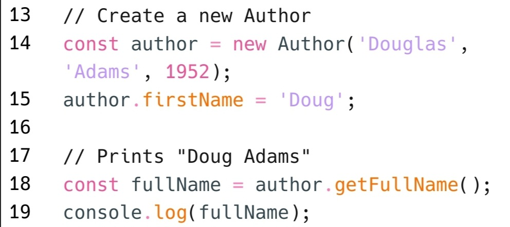

# replit
Oxocarbon port for replit.com

## About this port
This is a port of the [Oxocarbon](https://github.com/nyoom-engineering/oxocarbon) colorscheme made by [Nyoom Engineering](https://github.com/nyoom-engineering) to [replit](https://replit.com), a software development & deployment platform for building, sharing, and shipping software.

## How to use
You can click on the images below to pick the theme you wanna use. Then click on the "Use theme" button below the theme's name.

<a href="https://replit.com/theme/@xStormyy/oxocarbon-dark">
  </img>
</a>
<a href="https://replit.com/theme/@xStormyy/oxocarbon-light">
  </img>
</a>

## Credits
Thank you to [Shaunsingh](https://github.com/shaunsingh) for the original theme implementation in Neovim as well as base16
